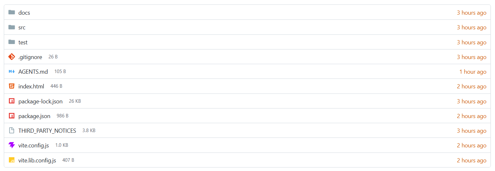

<p align="center">
  
</p>

# octopus-file-browser

A responsive, framework-free file browser inspired by Gitea. It ships as an accessible Web Component with Material Icon Theme icons and no runtime dependencies.



## Install

```sh
npm install octopus-file-browser
```

## Use

```html
<octopus-file-browser empty-label="No files"></octopus-file-browser>

<script type="module">
  import 'octopus-file-browser';

  const browser = document.querySelector('octopus-file-browser');

  async function open(path) {
    const response = await fetch(`/api/ls?path=${encodeURIComponent('/' + path.join('/'))}`);
    const entries = await response.json();
    browser.path = path;
    browser.entries = entries;
  }

  browser.addEventListener('octopus:navigate', ({ detail }) => open(detail.path));
  browser.addEventListener('octopus:open', ({ detail }) => console.log(detail.path, detail.entry));

  open([]);
</script>
```

Importing the package registers `<octopus-file-browser>`. The browser displays one directory at a time: your app sets `path` and that directory's `entries`. Selecting a directory or `..` emits `octopus:navigate` with the requested path, and your app loads that directory and sets both again. Selecting a file emits `octopus:open`.

## Entry data

| Field | Type | Description |
| --- | --- | --- |
| `name` | `string` | Displayed filename. |
| `type` | `"file" \| "directory"` | Entry kind. |
| `size` | `number` | File size in bytes. |
| `modified` | `Date \| string \| number` | Modified time. |
| `icon` | `string` | Optional custom icon URL. |

Directories are sorted before files. Names use natural, case-insensitive sorting.

## API

| API | Description |
| --- | --- |
| `browser.entries` | Gets or replaces the current directory's entries. |
| `browser.path` | Gets or sets the current directory path, for example `['home', 'ubuntu']`. `..` is shown when it is not empty. |
| `browser.contextMenu` | Gets or sets the context menu items. Empty by default. |
| `empty-label` | Attribute controlling the empty-directory message. |
| `octopus:open` | Event with `{ entry, path }` when a file is selected. |
| `octopus:navigate` | Event with `{ path }` when a directory or `..` is selected. The browser does not change until your app sets `path` and `entries`. |

The package also exports `OctopusFileBrowser`, `createOctopusFileBrowser`, `sortEntries`, `formatFileSize`, `formatRelativeDate`, `isRecent`, and `fileKindLabel`. Type declarations are included.

## Context menu

The context menu is off until you set items. Right-click, the Menu key, or a touch long press on a file or directory opens it.

```js
browser.contextMenu = [
  { label: 'Copy path', action: (entry, path) => navigator.clipboard.writeText('/' + path.join('/')) },
  { label: 'New folder…', when: (entry) => entry.type === 'directory', action: (entry, path) => createFolder(path) },
  { label: 'Download', when: (entry) => entry.type === 'file', action: (entry, path) => download(path) },
  { label: 'Validate JSON', when: (entry) => entry.name.endsWith('.json'), action: (entry, path) => validate(path) },
  { label: 'Delete', danger: true, action: (entry, path) => remove(path) },
];
```

| Field | Type | Description |
| --- | --- | --- |
| `label` | `string` | Menu item text. |
| `action` | `(entry, path) => void` | Called when the item is selected. |
| `when` | `(entry, path) => boolean` | Optional. Shows the item only for entries it returns `true` for. Items without `when` show for every entry. |
| `danger` | `boolean` | Optional. Styles the item as destructive. |

Items appear in the order given. When no item matches an entry, the native context menu is shown instead.

## Theme

Set CSS custom properties on the element:

```css
octopus-file-browser {
  --ofb-border: #d0d7de;
  --ofb-text: #181c21;
  --ofb-muted: #57606a;
  --ofb-link: #1f2328;
  --ofb-hover: #f6f8fa;
  --ofb-focus: #0969da;
  --ofb-recent: #d15700;
  --ofb-danger: #cf222e;
}
```

## Repository outputs

- `dist/` contains the publishable ESM and UMD/CJS library builds.
- `demo/` is the static demo and can be used as a Cloudflare Pages output directory.
- `npm run check` runs tests and rebuilds both outputs.

See [LICENSE](LICENSE) and [THIRD_PARTY_NOTICES](THIRD_PARTY_NOTICES).
